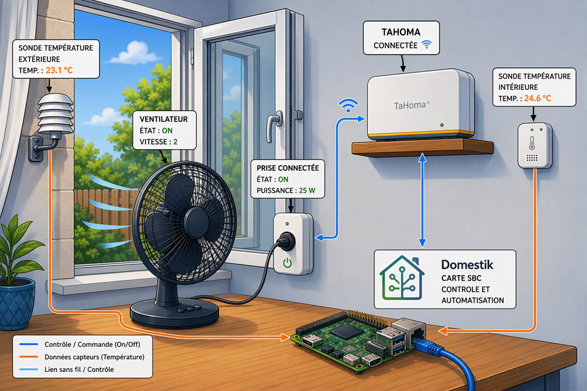
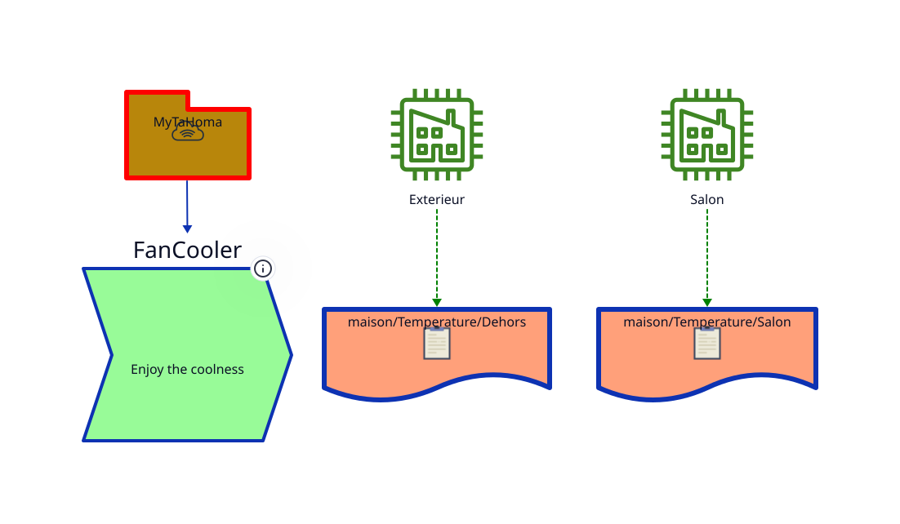

It's hot, sometimes unbearably so, but fortunately the outdoor temperature drops during the night.  
The purpose of this small project is to automatically control a fan and bring cooler outside air into the house whenever the outdoor temperature becomes lower than the indoor temperature.

# Marcel

Marcel publishes the indoor and outdoor temperatures and controls the fan through a Zigbee smart plug.

# Majordome

Majordome is responsible for the automation :
- Gathering indoor and outdoor temperature data.
- Using two **trackers** :
  - The first detects when the outdoor temperature becomes slightly cooler than the indoor temperature and turns the fan on at the start of the night.
  - The second detects when the outdoor temperature becomes warmer again and turns the fan off in the morning.

**Notez-bien :** the night cooling cycle is not started automatically. User intervention is required to open the window before the system can begin ventilation.
