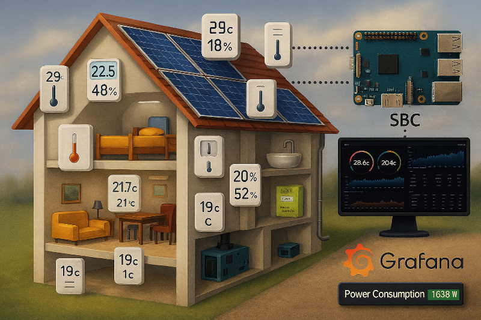
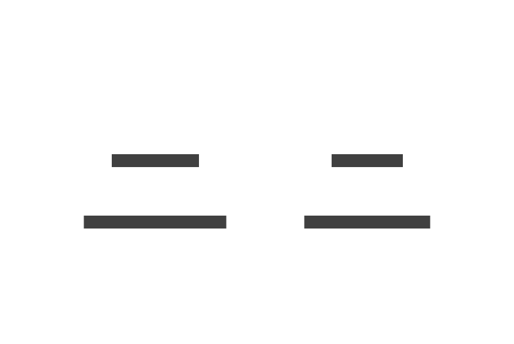
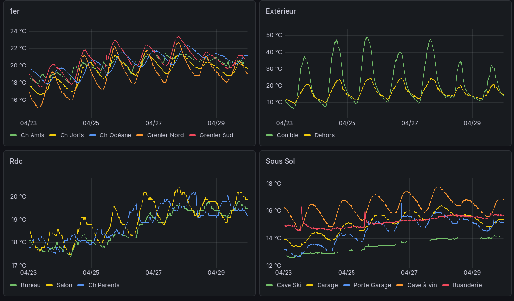

This use case demonstrates how to efficiently manage the entire data lifecycle with minimal effort using [Majordom](../../../Majordome/).  
It covers the ingestion of measurements from a **1‑Wire multi‑sensor probe**, their storage in a database, progressive transformation based on data
maturity, and the eventual cleanup of outdated data.

# A little talk about data maturity : From Raw Sensors to Golden Insights

## Storage

> [!Note]
> While a dedicated TSDB (like InfluxDB) is often preferred for time-series data, I opted for **PostgreSQL**.
> It provides robust performance for my current home automation scale and avoids the overhead of managing multiple database engines.

## Data maturity

In a modern data architecture, the primary goal is to transition from "**noise**" to "**value**". For environmental monitoring—such as tracking
temperature and humidity, this process ensures that a database does more than just archive raw numbers; it provides reliable, high-integrity information.  
When targeting low-profile SBCs (Single Board Computers), implementing an optimized Data Mart is not merely a "best practice"—it is a technical obligation :
Operating within the constraints of limited CPU, RAM, and storage requires a conservative data strategy.

While the example here focuses on environmental sensors, this framework is universal and can be applied to any data stream to ensure scalability and long-term stability.

> [!TIP]
> While the **BananaPi** provides native SATA support—effectively bypassing the high failure rates of SDCards and enabling high-capacity storage,
> this hardware advantage does not justify inefficient data management.  
> Optimizing our storage remains a priority for one critical reason: **Backups** (You are planning a backup strategy, aren't you?).
>
> By maintaining a lean, well-structured database, we ensure that backups are not only faster to execute but also significantly easier to
>  transport, verify, and restore. In the world of data, "*smaller*" translates directly to "*more resilient*".

### Raw Data (The Landing Zone) : The Bronze Layer

This is the entry point for raw sensor telemetry. In the Domestik ecosystem, we do not persist raw data to the database; doing so would be a needless waste of resources.
Instead, data is intercepted and handled in real-time by Marcel, ensuring the system remains lean from the very first byte.

### The Silver Layer: Cleansed & Standardized (The Quality Zone)

At this stage, data is validated and refined. For example, a 1-Wire reading of `85°C` (a classic sign of power failure) is rejected.
Calibration offsets are applied here to ensure accuracy.

> [!Note]
> **Technical Implementation:** Marcel performs this sanitization via Lua user functions and publishes the "Silver Data" to the MQTT bus.
> A Majordome flow then consumes this trustworthy stream for database storage.

### The Gold Layer: Aggregated & Optimized (The Value Zone)

The Gold layer represents the final stage of maturity. It represents the "truth" for the end-user. 
By removing redundant data points and calculating meaningful aggregates (averages, hourly/daily trends), we transform raw points into actionable insights.
This layer is what powers dashboards and long-term history, optimized for speed and minimal storage footprint.

> [!Note]
> **Technical Implementation:** Unlike other solutions that perform transformations "on the fly", the Gold transformation in our architecture is a decoupled, scheduled process.  
> Managed by Majordome, this task runs on a specific schedule to process data that is at least one week old. By delaying this transformation, we ensure that:
> * **System Load is Balanced**: High-intensity tasks are spread across distinct time windows to balance the load.
> * **Data Integrity**: We operate on a stabilized "Silver" dataset, allowing for more reliable deduplication and trend analysis.
> * **Efficiency**: Majordome handles the heavy lifting only once per data block, keeping the "Gold" tables ultra-lean and ready for fast querying.

# The 1-wire probe
## Hardware

> [!Note]
> This guide assumes a functional 1-Wire network and configured OWFS; the initial Linux-side setup will not be covered here.

The sensor probe is a popular DIY design as shared by [Mariusz Białończyk](https://skyboo.net/2017/03/ds2438-based-1-wire-humidity-sensor/). It combines two main components:
- **HIH-4000-003** : The analog humidity sensor.
- **DS-2438** : A "*Smart Battery Monitor*" used here as a 1-Wire ADC to digitize the humidity signal.

## From OWFS to MQTT topics

> [!NOTE]
> While the Linux kernel natively handles a subset of 1-wire probes, I far prefer using [OWFS](https://www.owfs.org/) for its superior versatility
>  and completeness.
> Regardless of the method chosen, data can be seamlessly accessed using Marcel's FFV, as detailed below.

 While these chips can track voltage and current, we are only interested in **temperature** and **humidity** for this build.

| ❓ What | 🔗 OWFS address | 💬 Topic |
|----------|----------------|----------|
| Temperature (°C) | 26.86B36A020000/temperature | maison/Temperature/Buanderie |
| Humidity (%) | 26.86B36A020000/HIH4000/humidity | maison/Humidity/Buanderie |

# publishing figures with Marcel

**[Marcel](https://github.com/destroyedlolo/Marcel)** is a lightweight daemon designed to broadcast various metrics to our MQTT bus, 
including data exposed by TaHoma and the 1-wire network. Configuration is available in the [/Marcel](Marcel) subdirectory.

- `10_mod_1wire` : 1-Wire module initialization.
- `50_Probe` : Defines the **Flat File Value** (FFV) for retrieving probe own data. Data is polled at 5-minute intervals.

> [!TIP]
> While primarily designed for 1-Wire sensors via OWFS, **FFV** is compatible with any value exposed as a flat file
> in Linux—including local system sensors located in `/sys/class/hwmon/`. Naturally, certain protocol-specific directives will not apply in these cases.

# Database related

The storage strategy is primarily driven by how the data will be consumed. In this case, I chose a *table-per-metric* approach
to optimize resource usage during report generation. This follows a two-tier structure: a *Silver table* for recent,
high-granularity data, and a *Gold table* for long-term storage of aggregated data.

The [create_temperatures.sql](db/create_temperatures.sql) and [create_temperatures_archive.sql](db/create_temperatures_archive.sql)
scripts initializes the table and its associated indexes to ensure optimal query performance.

For instance, a comprehensive small terme temperature report.

Despite the modest hardware specifications of the Banana Pi M1, query performance remains exceptional—consistently clocking in
at **under one second**. By shifting the heavy lifting, such as aggregations and data maturation, to offline batch processes
rather than performing them on-the-fly, the database serves only **lightweight, pre-processed results** to the frontend.
This ensures a snappy user experience while preventing system overload during peak reporting periods.

# Implementing the Bronze-Silver-Gold Pipeline using Majordome

