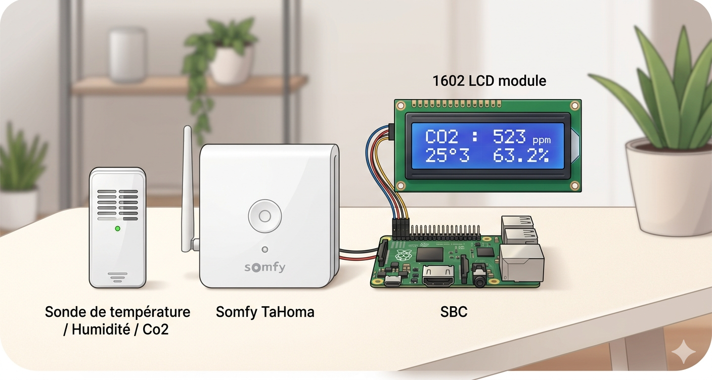
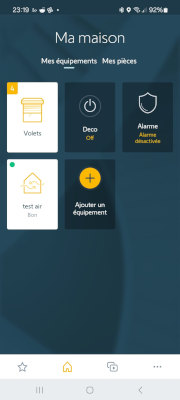
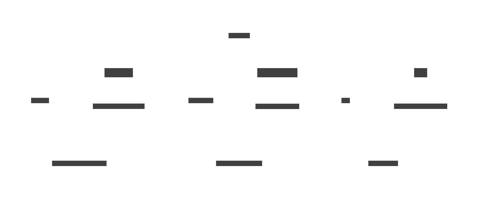
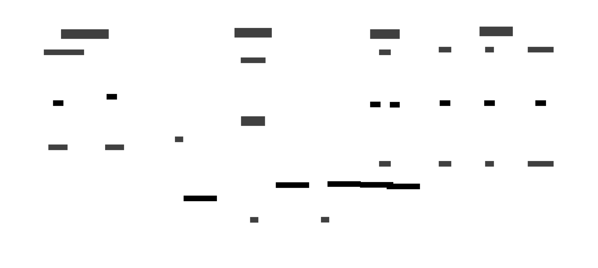
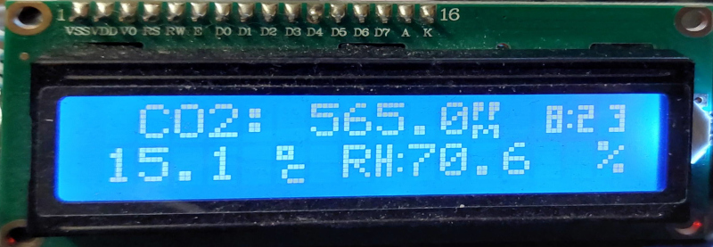

Bridging your **TaHoma gateway** with an **MQTT broker** unlocks immense potential: it allows you to generate
cross-referenced analytics, leverage **Majordome**’s powerful automation engine, and—as we will explore here—
significantly enhance your data visualization using low-cost devices.

This project shows how to retrieve data from a **Zigbee 3.0 multi-sensor** and display it on a classic 
**16x02 I2C LCD screen**.

# 📋 Table of Contents

- [📋 Table of Contents](#-table-of-contents)
- [🔗 The Zigbee multi-sensor](#-the-zigbee-multi-sensor)
   * [Pair the sensor with the TaHoma](#pair-the-sensor-with-the-tahoma)
   * [How the sensor is exposed in the TaHoma ?](#how-the-sensor-is-exposed-in-the-tahoma-)
      + [Discovering the TaHoma](#discovering-the-tahoma)
      + [Discovering the specific endpoints for your "Test Air" probe](#discovering-the-specific-endpoints-for-your-test-air-probe)
   * [Exposed multi-sensors figures](#exposed-multi-sensors-figures)
- [🚀 Configure Marcel to publish figures](#-configure-marcel-to-publish-figures)
   * [Let's start Marcel](#lets-start-marcel)
- [📟 Textual LCD screen](#-textual-lcd-screen)
   * [Majordome's](#majordomes)

# 🔗 The Zigbee multi-sensor

For this setup, we use a commercial Zigbee 3.0 multi-sensor monitoring **Humidity**, **Temperature**,
and **CO2 levels**. The TaHoma gateway acts as the bridge between the Zigbee mesh and our local MQTT network.

## Pair the sensor with the TaHoma

The first step is to detect and pair the sensor. Please follow the pairing procedure provided in the TaHoma mobile application.

Below are the results of the discovery of my Zigbee multi-sensor, named "Test Air," as displayed within the TaHoma mobile application.




## How the sensor is exposed in the TaHoma ?

### Discovering the TaHoma

Follow the [TaHomaCtl installation guide](https://github.com/destroyedlolo/TaHomaCtl) to:

- Enable the **developer mode** in your TaHoma (and get the **bearer code**) 
- Install **TaHomaCtl**.

> [!TIP]
> Instead of hardcoding the bearer token directly into the configuration, store it in a file and
> use `TaHoma_token @/path/to/file` to load it into TaHomaCtl.
> This file will then be reused accordingly in Marcel.
>
> In my case it will be stored in `/home/laurent/.tahomatoken`

### Discovering the specific endpoints for your "Test Air" probe

```
$ ./TaHomaCtl -Uv
*W* SSL chaine not enforced (unsafe mode)
TaHomaCtl > scan_Devices 
*I* 15 devices
TaHomaCtl > Device
... some other devices here ...
test_air : zigbee://2095-0445-1705/58849/1#1
test_air : zigbee://2095-0445-1705/58849/1#2
test_air : zigbee://2095-0445-1705/58849/3
test_air : zigbee://2095-0445-1705/58849/1#4
test_air : zigbee://2095-0445-1705/58849/0
test_air : zigbee://2095-0445-1705/58849/1#3
... some other devices here ...
```

As shown above, "**test_air**" is displayed as several devices, with each corresponding
to a specific sensor (and possibly more). By using the `Device` or `Status` commands,
you can explore further and retrieve the data you are looking for.  
This process can be automated by creating a temporary script as follows 

```bash
echo "scan_Devices" > /tmp/script
TaHomaCtl -U << eof | grep 'test_air : ' | awk -F' : ' '{print "Device " $2 }' >> /tmp/script
scan_Devices
Device
eof
```

> [!NOTE]
> Don't forget to change **test_air :** with the your probe's name.

Finally, run it :

```bash
TaHomaCtl -Utvf /tmp/script
```

The output will provide the known commands and states for each probe. As example

```
test_air : zigbee://2095-0445-1705/58849/1#3
	Commands
		ping (0 arg)
		advancedRefresh (1 arg)
		bind (2 args)
		stopIdentify (0 arg)
		identify (0 arg)
		unbind (2 args)
	States
		core:StatusState
		zigbee:PowerSourceState
		core:ProductModelNameState
		core:ManufacturerNameState
		zigbee:ZigbeeUpdateDownloadProgressState
		core:CO2ConcentrationState
		zigbee:LinkQualityIndicatorState
		zigbee:ZigbeeUpdateState
		core:RSSILevelState
		core:DiscreteRSSILevelState
		core:FirmwareRevisionState
```

Here, we discovered **core:CO2ConcentrationState** on **zigbee://2095-0445-1705/58849/1#3**

```
TaHomaCtl > States zigbee://2095-0445-1705/58849/1#3 core:CO2ConcentrationState
455
```

## Exposed multi-sensors figures

| ❓ What| 🔗 Device's URL | ⚙️ State | 💬 MQTT Topic |
|-----|--------------|-------|-------|
| Humidity | zigbee://2095-0445-1705/58849/1#2 | core:RelativeHumidityState | TestZigbee/RelativeHumidity |
| CO2 | zigbee://2095-0445-1705/58849/1#3 | core:CO2ConcentrationState | TestZigbee/CO2 |
| Temperature | zigbee://2095-0445-1705/58849/1#1 | core:TemperatureState | TestZigbee/Temperature |

# 🚀 Configure Marcel to publish figures

**[Marcel](https://github.com/destroyedlolo/Marcel)** is a lightweight daemon 
designed to broadcast various metrics to our MQTT bus, including data exposed
by TaHoma. Configuration is available in the [/Marcel](Marcel) subdirectory.



- `10_mod_TaHoma` : Initializes the module.
- `30_MyTaHoma` : Defines the gateway and event filters.
- `50_*`: **Crucial Step**. Since Zigbee sensors only send data on change (event-driven), Probes perform an active sync at startup to avoid "blind spots" in your dashboard.

## Let's start Marcel

```
Marcel -vf DisplayZigbeeData/Marcel/
```

Output example :
```
20260426 15:38:51	TestZigbee/RelativeHumidity	70.7
20260426 15:38:51	TestZigbee/CO2	493
20260426 15:38:51	TestZigbee/Temperature	15.1
```

# 📟 Textual LCD screen

Finally, we use the **LCD plugin** of [Majordome](https://github.com/destroyedlolo/Majordome/) to display these 
MQTT topics on a **16x2** or **20x4** **textual I2C LCD screens**.

> [!Note]
> **Prerequisites**: Ensure your I2C stack is active and the Majordome LCD plugin is enabled.

## Majordome's

All configuration files required for Majordome are located in the [RealTime_LCD](./RealTime_LCD) subdirectory.
The main configuration file is found at its root and must be updated to match your specific infrastructure.



- `00_Majordome` : all Majordome's own routine, like log rotation
- `10_LCD` : the screen own configuration
  - `LCD.LCD` : hardware configuration (to be customized as well)
  - `LCD.shutdown` : clean shutdown of the screen
  - `LCD.Decoration` : static screen fixed decorators
- `20_DefChar` : This display type supports up to 8 custom characters; we will leverage this feature to optimize screen real estate
- `40_Zigbee` : For each sensor reading, we define the target data and its designated screen position. The associated Lua code snippets demonstrate how the values are formatted for the display
- `40_Clock` : To include a real-time clock without cluttering the interface, we leverage character redefinition to fit
the time into just two character slots. By creating custom glyphs for paired digits, we maintain a compact and
readable timestamp.


