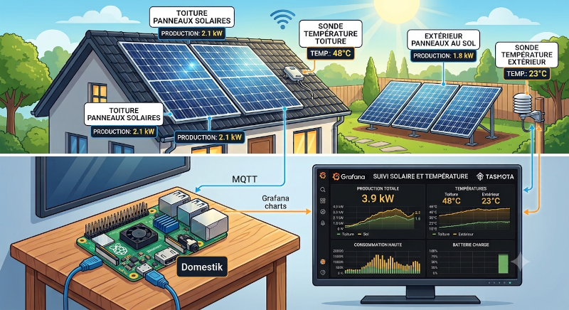

I have two solar installations at home:

- **Rooftop solar** : Monitored directly via my grid's smart meter.
- **Ground-mounted solar** : Operated by a standalone inverter with no local
communication capabilities.

The goal of this project is to collect and store production statistics from
both systems. By analyzing this data, I aim to build a predictive model that
estimates the ground-mounted system's output based solely on the real-time
data from the rooftop installation.
