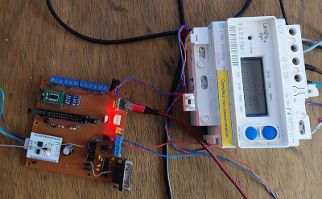

I have two solar installations at home:

- **Rooftop solar** : Monitored directly via my grid's smart meter.
- **Ground-mounted solar** : Operated by a standalone inverter with no local
communication capabilities.

The goal of this project is to collect and store production statistics from
both systems. By analyzing this data, I aim to build a predictive model that
estimates the ground-mounted system's output based solely on the real-time
data from the rooftop installation.

# Data Collection

Since the efficiency of photovoltaic panels is directly affected by ambient temperature, the following datasets have been identified for collection and analysis :

## Rooftop Feed-in Tariff (OA) Solar Panels

### Attic Temperature

This information is provided by a 1-Wire temperature sensor installed in the attic. Measurements are recorded and transmitted every five minutes.

### Generated Power

Instantaneous production data is retrieved directly from the **production Linky meter** through its TIC (Télé-Information Client) interface : 
The **INSTI** metric is published every second by [TeleInfod](https://github.com/destroyedlolo/TeleInfod).

## Self-Consumption Solar Panels ( "AutoConso" )

### Outdoor temperature

Also monitored using a 1-Wire temperature sensor, with measurements published every five minutes.  

It should be noted that this sensor is installed in the shade and sheltered from the wind. As a result, it measures a **standardized ambient air temperature** rather than 
the temperature actually experienced by the solar panels as exposed to direct sunlight.

### Generated Power

Unfortunately, my inverter only communicates with its own proprietary cloud platform, and there is no practical way to automatically retrieve its 
data (*quite frustrating, to say the least !*).

To overcome this limitation, I built a homemade monitoring solution called **Frankenstein**, assembled from spare hardware I already had available :
- My old **CBE energy meter**
- An ESP8266 flashed with Tasmota firmware, which reads the meter and publishes the measured apparent power (**PAPP**) every second.

