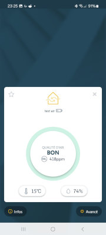
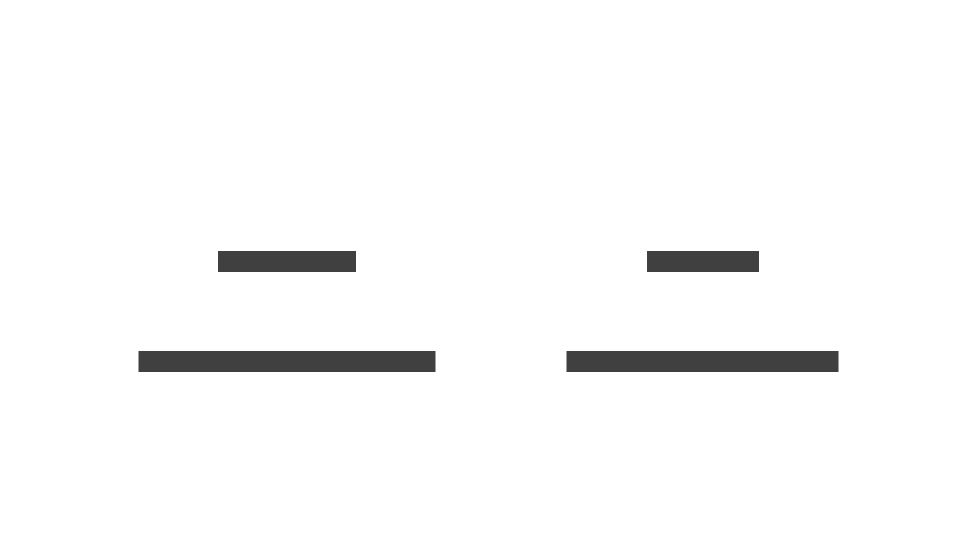
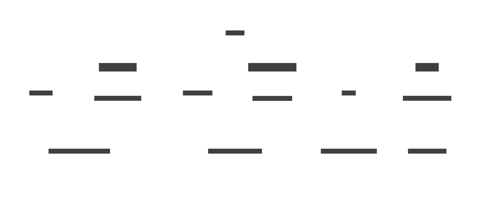
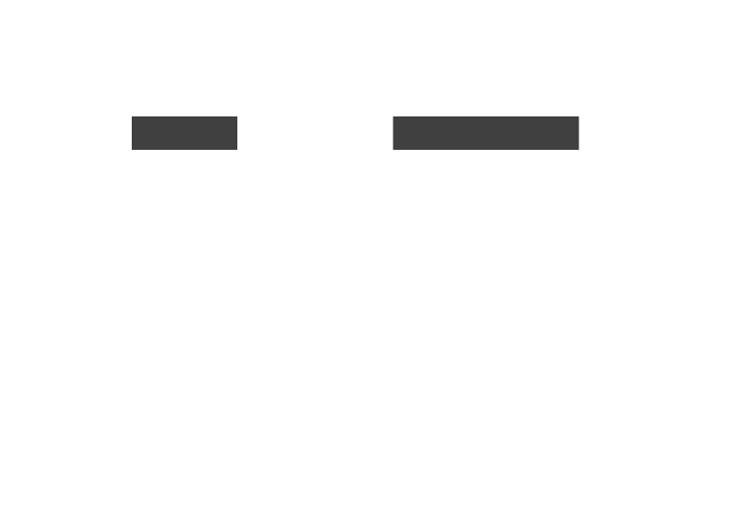

> [!Note]
> Originally, I intended to calibrate a Zigbee multi-sensor against a 1-wire reference probe. However, due to the Zigbee sensor's low sensitivity
> and a highly stable test environment, data updates are too sparse to establish a reliable correlation.

This tutorial demonstrates how to manage probes connected via a local **1-Wire** network alongside **Zigbee** devices integrated through a **TaHoma** gateway. We will see how to :

- **Interfacing with sensor data exposed as Linux files**, with a specific focus on 1-wire probes.
- **Accessing data from sensors attached to a TaHoma**, whether they use IO, Zigbee, Matter, or any other protocol supported locally by this gateway.
- **Data storage and lifecycle management**, covering how to save and handle your data over time, using **Majordome**.
- **Various visualization** methods to display your results.

# Table of Contents

- [Table of Contents](#table-of-contents)
- [Hardware side](#hardware-side)
   * [The 1-wire probe](#the-1-wire-probe)
   * [The Zigbee multi-sensor](#the-zigbee-multi-sensor)
      + [Pair the sensor with the TaHoma](#pair-the-sensor-with-the-tahoma)
      + [How the sensor is exposed in the TaHoma ?](#how-the-sensor-is-exposed-in-the-tahoma-)
         - [Discovering the TaHoma](#discovering-the-tahoma)
         - [Discovering the probe](#discovering-the-probe)
- [MQTT data bus side](#mqtt-data-bus-side)
   * [from 1-wire probe](#from-1-wire-probe)
      + [Figures](#figures)
   * [from the Zigbee probe](#from-the-zigbee-probe)
- [Configure Marcel to publish figures](#configure-marcel-to-publish-figures)
   * [for the 1-wire probe](#for-the-1-wire-probe)
   * [For the Zigbee probe](#for-the-zigbee-probe)
   * [First result](#first-result)
- [Real time value monitoring](#real-time-value-monitoring)
   * [Simple MQTT Grafana report](#simple-mqtt-grafana-report)
   * [Textual LCD screen](#textual-lcd-screen)
- [Historical data storage](#historical-data-storage)
   * [A little talk about data maturity : From Raw Sensors to Golden Insights](#a-little-talk-about-data-maturity-from-raw-sensors-to-golden-insights)
      + [Raw Data (The Landing Zone) : The Bronze Layer](#raw-data-the-landing-zone-the-bronze-layer)
      + [The Silver Layer: Cleansed & Standardized (The Quality Zone)](#the-silver-layer-cleansed-standardized-the-quality-zone)
      + [The Gold Layer: Aggregated & Optimized (The Value Zone)](#the-gold-layer-aggregated-optimized-the-value-zone)
   * [Create database dedicated tables](#create-database-dedicated-tables)
- [Configure Majordome to feed the database](#configure-majordome-to-feed-the-database)
- [Get the result in Grafana](#get-the-result-in-grafana)

# Hardware side
## The 1-wire probe

> [!Note]
> This guide assumes a functional 1-Wire network and configured OWFS; the initial Linux-side setup will not be covered here.

The sensor probe is a popular DIY design as shared by [Mariusz Białończyk](https://skyboo.net/2017/03/ds2438-based-1-wire-humidity-sensor/). It combines two main components:
- **HIH-4000-003** : The analog humidity sensor.
- **DS-2438** : A "*Smart Battery Monitor*" used here as a 1-Wire ADC to digitize the humidity signal.

## The Zigbee multi-sensor

For this setup, I am utilizing a commercial Zigbee 3.0 multi-sensor that monitors humidity, temperature, and CO2​ levels. A TaHoma gateway serves as the bridge between the Zigbee network and my MQTT broker.

### Pair the sensor with the TaHoma

The first step is to detect and pair the sensor. Please follow the pairing procedure provided in the TaHoma mobile application.

Below are the results of the discovery of my Zigbee multi-sensor, named "Test Air," as displayed within the TaHoma mobile application.




### How the sensor is exposed in the TaHoma ?

#### Discovering the TaHoma

Follow the [TaHomaCtl installation guide](https://github.com/destroyedlolo/TaHomaCtl) to:

- Enable the **developer mode** in your TaHoma (and get the **bearer code**) 
- Install **TaHomaCtl**.
- Enable developer mode on the TaHoma hub, ensuring you apply the bearer code.
- Discover your gateway.

> [!TIP]
> Instead of hardcoding the bearer token directly into the configuration, store it in a file and
> use `TaHoma_token @/path/to/file` to load it into TaHomaCtl.
> This file will then be reused accordingly in Marcel.
>
> In my case it will be stored in `/home/laurent/.tahomatoken`

#### Discovering the probe

```
$ ./TaHomaCtl -Uv
*W* SSL chaine not enforced (unsafe mode)
TaHomaCtl > scan_Devices 
*I* 15 devices
TaHomaCtl > Device
... some other devices here ...
test_air : zigbee://2095-0445-1705/58849/1#1
test_air : zigbee://2095-0445-1705/58849/1#2
test_air : zigbee://2095-0445-1705/58849/3
test_air : zigbee://2095-0445-1705/58849/1#4
test_air : zigbee://2095-0445-1705/58849/0
test_air : zigbee://2095-0445-1705/58849/1#3
... some other devices here ...
```

As shown above, "**test_air**" is displayed as several devices, with each corresponding
to a specific sensor (and possibly more). By using the `Device` or `Status` commands,
you can explore further and retrieve the data you are looking for.  
This process can be automated by creating a temporary script as follows 

```bash
echo "scan_Devices" > /tmp/script
TaHomaCtl -U << eof | grep 'test_air : ' | awk -F' : ' '{print "Device " $2 }' >> /tmp/script
scan_Devices
Device
eof
```

> [!NOTE]
> Don't forget to change **test_air :** with the your probe's name.

Finally, run it :

```bash
TaHomaCtl -Utvf /tmp/script
```

The output will provide the known commands and states for each probe. As example

```
test_air : zigbee://2095-0445-1705/58849/1#3
	Commands
		ping (0 arg)
		advancedRefresh (1 arg)
		bind (2 args)
		stopIdentify (0 arg)
		identify (0 arg)
		unbind (2 args)
	States
		core:StatusState
		zigbee:PowerSourceState
		core:ProductModelNameState
		core:ManufacturerNameState
		zigbee:ZigbeeUpdateDownloadProgressState
		core:CO2ConcentrationState
		zigbee:LinkQualityIndicatorState
		zigbee:ZigbeeUpdateState
		core:RSSILevelState
		core:DiscreteRSSILevelState
		core:FirmwareRevisionState
```

Here, we discovered **core:CO2ConcentrationState** on **zigbee://2095-0445-1705/58849/1#3**

```
TaHomaCtl > States zigbee://2095-0445-1705/58849/1#3 core:CO2ConcentrationState
455
```

# MQTT data bus side

Domestik components interact through an MQTT broker; every data point is published
to its **own unique topic**.

## from 1-wire probe
### Figures
 While these chips can track voltage and current, we are only interested in **temperature** and **humidity** for this build.

| ❓ What | 🔗 OWFS address | 💬 Topic |
|----------|----------------|----------|
| Temperature (°C) | 26.86B36A020000/temperature | SensorCalibration/reference/temperature |
| Humidity (%) | 26.86B36A020000/HIH4000/humidity | SensorCalibration/reference/humidity |

## from the Zigbee probe

| ❓ What| 🔗 Device's URL | ⚙️ State | 💬 Topic |
|-----|--------------|-------|-------|
| CO2 | zigbee://2095-0445-1705/58849/1#3 | core:CO2ConcentrationState | SensorCalibration/CO2 |
| Temperature | zigbee://2095-0445-1705/58849/1#1 | core:TemperatureState | SensorCalibration/Temperature |
| Humidity | zigbee://2095-0445-1705/58849/1#2 | core:RelativeHumidityState | SensorCalibration/RelativeHumidity |

# Configure Marcel to publish figures

Time to get that data published !  
**[Marcel](https://github.com/destroyedlolo/Marcel)** is a lightweight daemon designed to broadcast various metrics to our MQTT bus, including data exposed by TaHoma and the 1-wire network. Configuration is available in the [/Marcel](Marcel) subdirectory.

## for the 1-wire probe

> [!NOTE]
> While the Linux kernel natively handles a subset of 1-wire probes, I far prefer using [OWFS](https://www.owfs.org/) for its superior versatility
>  and completeness.
> Regardless of the method chosen, data can be seamlessly accessed using Marcel's FFV, as detailed below.



- `10_mod_1wire` : 1-Wire module initialization.
- `50_Probe` : Defines the **Flat File Value** (FFV) for retrieving probe own data. Data is polled at 5-minute intervals.

## For the Zigbee probe

> [!NOTE]
> **How Zigbee sensors Work**  
> In a typical event-driven architecture, you only receive data when a change occurs. This creates a *blind spot* when the daemon starts.
> `Probes` solve this by performing an active synchronization at launch.



- `10_mod_TaHoma` : TaHoma module initialization.
- `30_MyTaHoma` : Configures the gateway based on TaHomaCtl discovery and defines event filters.
- `50_*`: Addresses infrequent event updates by implementing `Probes` that broadcast the last known sensor states upon startup.

## First result

Marcel can now be launched using this new configuration. You can track the values by monitoring the SensorCalibration/# hierarchy.

```bash
Marcel -vf ../Domestik/TaHomaZigbee/Marcel/
```

# Real time value monitoring

## Simple MQTT Grafana report

Published raw values can be visualized in the [Raw probe calibration](Grafana/RPCF.json) Grafana report.

## Textual LCD screen

With its **LCD plugin**, [Majordome](https://github.com/destroyedlolo/Majordome/) allows users to conveniently create small 
dashboards on popular **16x2** or **20x4** **textual I2C LCD screens**.

> [!Note]
> This tutorial does not cover the installation of the screen, configuration of the I2C stack, or the activation of
> Majordome's LCD plugin. Please ensure these prerequisites are completed beforehand.

# Historical data storage

> **Note on Architecture:** While a dedicated TSDB (like InfluxDB) is often preferred for time-series data, I opted for **PostgreSQL**.
> It provides robust performance for my current home automation scale and avoids the overhead of managing multiple database engines.

## A little talk about data maturity : From Raw Sensors to Golden Insights

In a modern data architecture, the primary goal is to transition from "**noise**" to "**value**". For environmental monitoring—such as tracking
temperature and humidity, this process ensures that a database does more than just archive raw numbers; it provides reliable, high-integrity information.  
When targeting low-profile SBCs (Single Board Computers), implementing an optimized Data Mart is not merely a "best practice"—it is a technical obligation :
Operating within the constraints of limited CPU, RAM, and storage requires a conservative data strategy.

While the example here focuses on environmental sensors, this framework is universal and can be applied to any data stream to ensure scalability and long-term stability.

> [!TIP]
> While the **BananaPi** provides native SATA support—effectively bypassing the high failure rates of SDCards and enabling high-capacity storage,
> this hardware advantage does not justify inefficient data management.  
> Optimizing our storage remains a priority for one critical reason: **Backups** (You are planning a backup strategy, aren't you?).
>
> By maintaining a lean, well-structured database, we ensure that backups are not only faster to execute but also significantly easier to
>  transport, verify, and restore. In the world of data, "*smaller*" translates directly to "*more resilient*".

### Raw Data (The Landing Zone) : The Bronze Layer

This is the entry point for raw sensor telemetry. In the Domestik ecosystem, we do not persist raw data to the database; doing so would be a needless waste of resources.
Instead, data is intercepted and handled in real-time by Marcel, ensuring the system remains lean from the very first byte.

### The Silver Layer: Cleansed & Standardized (The Quality Zone)

At this stage, data is validated and refined. For example, a 1-Wire reading of `85°C` (a classic sign of power failure) is rejected.
Calibration offsets are applied here to ensure accuracy.
* For 1-Wire: Marcel masters the scheduling, ensuring no duplicated data enters the stream.
* For Zigbee: Since these sensors push data autonomously, the stream is sanitized but remains "as-is" regarding frequency.

> [!Note]
> **Technical Implementation:** Marcel performs this sanitization via Lua user functions and publishes the "Silver Data" to the MQTT bus.
> A Majordome flow then consumes this trustworthy stream for database storage.

### The Gold Layer: Aggregated & Optimized (The Value Zone)

The Gold layer represents the final stage of maturity. It represents the "truth" for the end-user. 
By removing redundant data points and calculating meaningful aggregates (averages, hourly/dailt trends), we transform raw points into actionable insights.
This layer is what powers dashboards and long-term history, optimized for speed and minimal storage footprint.

> [!Note]
> **Technical Implementation:** Unlike other solutions that perform transformations "on the fly", the Gold transformation in our architecture is a decoupled, scheduled process.  
> Managed by Majordome, this task runs on a specific schedule to process data that is at least one week old. By delaying this transformation, we ensure that:
> * **System Load is Balanced**: High-intensity tasks are spread across distinct time windows to balance the load.
> * **Data Integrity**: We operate on a stabilized "Silver" dataset, allowing for more reliable deduplication and trend analysis.
> * **Efficiency**: Majordome handles the heavy lifting only once per data block, keeping the "Gold" tables ultra-lean and ready for fast querying.

## Create database dedicated tables

Figures from all probes is stored in the `figures` table, with two indexes specifically designed to speed up reporting.



The [create_figures.sql](db/create_figures.sql) script initializes the table and its associated indexes to ensure optimal query performance.

# Configure Majordome to feed the database

# Get the result in Grafana
