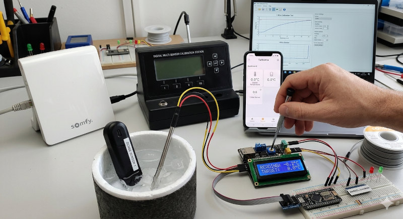
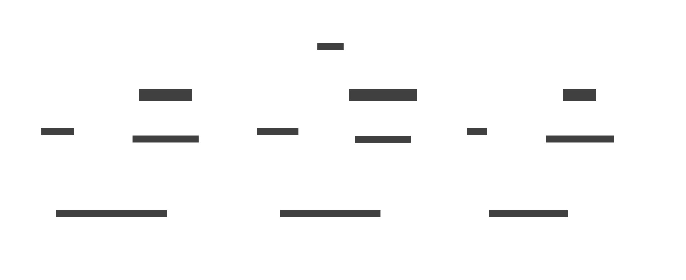

The goal of this procedure is to calibrate a 1-wire humidity sensor using data from a Zigbee multi-sensor as a reference.  
We will use **Marcel** to access the values of the sensor through a **TaHoma gateway**, then store the data in the **PostgreSQL database** using **Majordome**.
Finally, a graphical comparison will be performed in **Grafana**.

# Pair the sensor with the TaHoma

The first step is to detect and pair the sensor. Please follow the pairing procedure provided in the TaHoma mobile application.

Below are the results of the discovery of my Zigbee multi-sensor, named "Test Air," as displayed within the TaHoma mobile application.


# How the sensor is exposed in the TaHoma

## Discovering the TaHoma

Follow the [TaHomaCtl installation guide](https://github.com/destroyedlolo/TaHomaCtl) to:

- Enable the **developer mode** in your TaHoma (and get the **bearer code**) 
- Install **TaHomaCtl**.
- Enable developer mode on the TaHoma hub, ensuring you apply the bearer code.
- Discover your gateway.

> [!TIP]
> Instead of hardcoding the bearer token directly into the configuration, store it in a file and
> use `TaHoma_token @/path/to/file` to load it into TaHomaCtl.
> This file will then be reused accordingly in Marcel.
>
> In my case it will be stored in `/home/laurent/.tahomatoken`


## Discovering the probe

```
$ ./TaHomaCtl -Uv
*W* SSL chaine not enforced (unsafe mode)
TaHomaCtl > scan_Devices 
*I* 15 devices
TaHomaCtl > Device
test_air : zigbee://2095-0445-1705/58849/1#1
test_air : zigbee://2095-0445-1705/58849/1#2
test_air : zigbee://2095-0445-1705/58849/3
test_air : zigbee://2095-0445-1705/58849/1#4
Deco : io://2095-0445-1705/5335270
Porte_Chat : rts://2095-0445-1705/16774417
IO_(10069463) : io://2095-0445-1705/10069463
test_air : zigbee://2095-0445-1705/58849/0
ZIGBEE_(0/0) : zigbee://2095-0445-1705/0/0
Boiboite : internal://2095-0445-1705/pod/0
INTERNAL_(wifi/0) : internal://2095-0445-1705/wifi/0
test_air : zigbee://2095-0445-1705/58849/1#3
ZIGBEE_(0/242) : zigbee://2095-0445-1705/0/242
ZIGBEE_(0/1) : zigbee://2095-0445-1705/0/1
ZIGBEE_(65535) : zigbee://2095-0445-1705/65535
```

As shown above, "**test_air**" is displayed as several devices, with each corresponding
to a specific sensor (and possibly more). By using the `Device` or `Status` commands,
you can explore further and retrieve the data you are looking for.  
This process can be automated by creating a temporary script as follows 

```bash
echo "scan_Devices" > /tmp/script
TaHomaCtl -U << eof | grep 'test_air : ' | awk -F' : ' '{print "Device " $2 }' >> /tmp/script
scan_Devices
Device
eof
```

> [!NOTE]
> Don't forget to change **test_air :** with the your probe's name.

Finally, run it :

```bash
TaHomaCtl -Utvf /tmp/script
```

The output will provide the known commands and states for each probe. As example

```
test_air : zigbee://2095-0445-1705/58849/1#3
	Commands
		ping (0 arg)
		advancedRefresh (1 arg)
		bind (2 args)
		stopIdentify (0 arg)
		identify (0 arg)
		unbind (2 args)
	States
		core:StatusState
		zigbee:PowerSourceState
		core:ProductModelNameState
		core:ManufacturerNameState
		zigbee:ZigbeeUpdateDownloadProgressState
		core:CO2ConcentrationState
		zigbee:LinkQualityIndicatorState
		zigbee:ZigbeeUpdateState
		core:RSSILevelState
		core:DiscreteRSSILevelState
		core:FirmwareRevisionState
```

Here, we discovered **core:CO2ConcentrationState** on **zigbee://2095-0445-1705/58849/1#3**

```
TaHomaCtl > States zigbee://2095-0445-1705/58849/1#3 core:CO2ConcentrationState
455
```

# List of figures

Domestik components interact through an MQTT broker; every data point is published
to its **own unique topic**.

## Reference from the Zigbee probe

| ❓ What| 🔗 Device's URL | ⚙️ State | 💬 Topic |
|-----|--------------|-------|-------|
| CO2 | zigbee://2095-0445-1705/58849/1#3 | core:CO2ConcentrationState | SensorCalibration/reference/CO2 |
| Temperature | zigbee://2095-0445-1705/58849/1#1 | core:TemperatureState | SensorCalibration/reference/Temperature |
| Humidity | zigbee://2095-0445-1705/58849/1#2 | core:RelativeHumidityState | SensorCalibration/reference/RelativeHumidity |

## 1-wire probe to qualibrate

### Hardware Overview

The sensor probe is a popular DIY design as shared by [Mariusz Białończyk](https://skyboo.net/2017/03/ds2438-based-1-wire-humidity-sensor/). It combines two main components:
- **HIH-4000-003** : The analog humidity sensor.
- **DS-2438** : A "*Smart Battery Monitor*" used here as a 1-Wire ADC to digitize the humidity signal.

### Figures
 While these chips can track voltage and current, we are only interested in **temperature** and **humidity** for this build.

| ❓ What | 🔗 OWFS address | 💬 Topic |
|----------|----------------|----------|
| Temperature (°C) | 26.86B36A020000/temperature | SensorCalibration/temperature |
| Humidity (%) | 26.86B36A020000/HIH4000/humidity | SensorCalibration/humidity |

# Configure Marcel to publish figures

Time to get that data published !  
**[Marcel](https://github.com/destroyedlolo/Marcel)** is a lightweight daemon designed to broadcast various metrics to our MQTT bus, including data exposed by TaHoma and the 1-wire network. Configuration is available in the [/Marcel](Marcel) subdirectory.

## Reference's

> [!NOTE]
> **How Zigbee sensors Work**  
> In a typical event-driven architecture, you only receive data when a change occurs. This creates a *blind spot* when the daemon starts.
> `Probes` solve this by performing an active synchronization at launch.



- `10_mod_TaHoma` : TaHoma module initialization.
- `30_MyTaHoma` : Configures the gateway based on TaHomaCtl discovery and defines event filters.
- `50_*`: Addresses infrequent event updates by implementing `Probes` that broadcast the last known sensor states upon startup.

# Create database dedicated tables

# Configure Majordome to feed the database

# Get the result in Grafana
